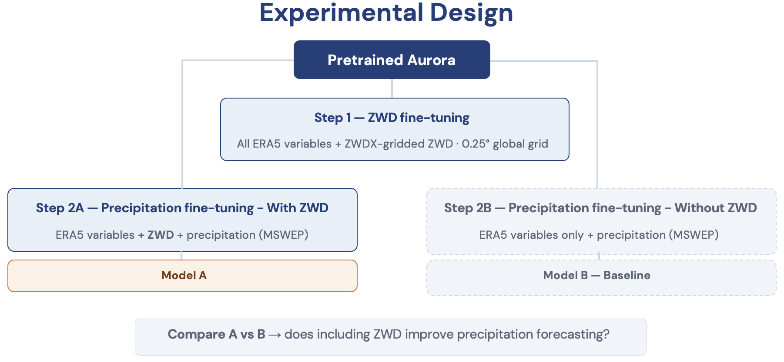
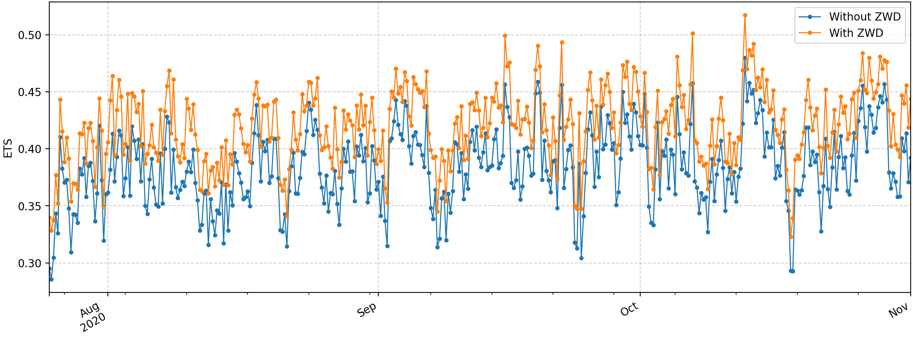
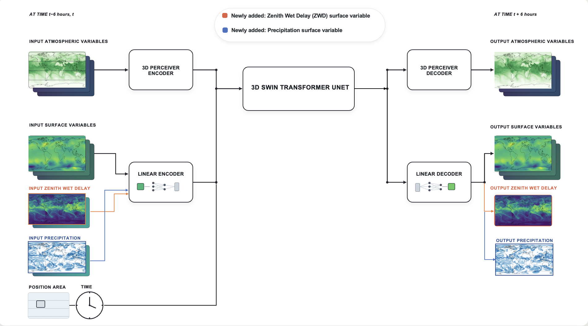

# ZWD into Aurora

**Integrating GNSS-Derived Zenith Wet Delay into a Weather Foundation Model Improves Precipitation Forecasting**

[](#citation)
[](LICENSE.txt)
[](https://github.com/microsoft/aurora)
[](https://github.com/swiss-ai/ESFM)

This repository contains the training, inference, and evaluation code accompanying
our paper on integrating **GNSS-derived Zenith Wet Delay (ZWD)** and
**six-hour accumulated precipitation** into [Aurora](https://github.com/microsoft/aurora),
a state-of-the-art weather foundation model.

> **Authors:** Leonardo Trentini, Fanny Lehmann, Laura Crocetti, Benedikt Soja
> · ETH Zurich
> **Paper:** _Geophysical Research Letters_ (under review) — see [Citation](#citation).

<p align="center">
  
</p>

## Overview

Ground-based Global Navigation Satellite System (GNSS) receivers measure the Zenith Wet Delay (ZWD), a direct, all-weather integral of atmospheric water vapour that has been assimilated into numerical weather prediction for decades but is not yet used by leading machine-learning weather models. We present the **first integration of GNSS-derived ZWD into a weather foundation model** and show that it addresses a well-known weakness of these models: the underestimation of severe precipitation.

We extend Aurora with ZWD as a new surface variable and fine-tune it for six-hour accumulated precipitation — a variable absent from Aurora's pretraining — **with** and **without** ZWD as auxiliary information. The contrast between the two models isolates the contribution of GNSS ZWD to precipitation forecast skill.

**Key points**

- Aurora learns GNSS Zenith Wet Delay as a new variable at a skill level on par with its already-pretrained variables.
- Adding ZWD systematically improves Aurora's precipitation forecasts, with the largest gains for the most extreme events.
- Including ZWD makes the predicted precipitation power spectrum more realistic at synoptic and planetary scales.

## Contents

- [Key results](#key-results)
- [Method](#method)
- [Repository layout](#repository-layout)
- [Installation](#installation)
- [Data](#data)
- [Usage](#usage)
  - [Configuration](#configuration)
  - [Training](#training)
  - [Inference](#inference)
  - [Pre- and post-processing](#pre--and-post-processing)
  - [Evaluation](#evaluation)
- [Model checkpoints](#model-checkpoints)
- [Troubleshooting](#troubleshooting)
- [Citation](#citation)
- [License and attribution](#license-and-attribution)
- [Acknowledgements](#acknowledgements)

## Key results

Including ZWD improves precipitation skill across deterministic, threshold-based, and spectral metrics, evaluated on a held-out 2020 test set at 6-hour lead time. The relative benefit **grows with event severity**, reaching a **+8.8% Equitable Threat Score (ETS) at the 99th percentile**, while the global RMSE decreases across most of the world (largest gains in the tropics and mid-latitude storm tracks).

| Metric (precipitation)            | Without ZWD | With ZWD | Rel. Δ |
| --------------------------------- | ----------- | -------- | ------ |
| RMSE [mm]                         | 1.015       | 0.997    | −1.8%  |
| MSE [mm²]                         | 1.032       | 0.994    | −3.7%  |
| FSS (95th pct)                    | 0.917       | 0.931    | +1.5%  |
| ETS (95th pct)                    | 0.581       | 0.604    | +3.9%  |
| **ETS (99th pct)**                | **0.395**   | **0.430**| **+8.8%** |
| Log Spectral Distance (total)     | 0.934       | 0.876    | −6.2%  |

<sub>Means over ten late-training checkpoints; all ETS gains significant under a checkpoint-wise paired *t*-test (*p* ≤ 0.013). Full tables and per-event diagnostics are in the paper.</sub>

<p align="center">
  <br/>
  <sub>ETS at the 99th percentile over the test period: the ZWD-enriched model outperforms the baseline at essentially every timestep.</sub>
</p>

## Method

Fine-tuning uses Aurora's standard variable-embedding mechanism — no bespoke modules, dedicated heads, or structural changes to the encoder, backbone, or decoder. The protocol has two stages:

- **Step 1 — ZWD fine-tuning.** Pretrained Aurora is fine-tuned on the full ERA5
  surface and pressure-level state augmented with ZWDX-gridded ZWD as a new
  surface variable, establishing that ZWD is learnable at parity with pretrained
  variables.
- **Step 2 — Precipitation fine-tuning.** Two models are initialised from the same
  Aurora checkpoint and trained with identical optimiser, schedule, step budget,
  and data, differing only in their variable set:
  - **Model A ("With ZWD")** — ZWD *and* precipitation as additional inputs/outputs
    (`--data_sources era5_zwd_precip`).
  - **Model B (baseline, "Without ZWD")** — precipitation only
    (`--data_sources era5_zwd_precip_without_zwd`).

The objective is a per-variable, latitude-weighted MAE; precipitation enters with weight 1 and ZWD with a tunable weight `λ_ZWD = 2` (see [`loss_config.yaml`](loss_config.yaml)).

<p align="center">
  
</p>

## Repository layout

```
.
├── aurora/                 # Aurora model (from microsoft/aurora) + ZWD/precip extensions
├── config.py               # CLI / argument parsing for training and inference
├── dataset_config.yaml     # Data-source definitions (era5_zwd_precip, ...)
├── loss_config.yaml        # Per-variable loss weights (incl. λ_ZWD)
├── train_fsdp.py           # Training entrypoint (FSDP, multi-node)
├── inference_direct.py     # Inference / rollout entrypoint
├── postprocessing_esfm.py  # Post-processing used by inference
├── create_zarr_zwdx.py     # Build the gridded ZWDX Zarr store
├── plot_prediction_comparison.py
├── utils/                  # Dataset, losses, metrics, model freezing, logging
├── scripts/
│   ├── training/           # SLURM launchers (train_zwd, train_zwd_precip, train_precip_without)
│   ├── inference/          # SLURM launchers + prediction merging
│   ├── preprocess/         # MSWEP 6-hour accumulation, ERA5 static fields
│   └── postprocess/        # ZWD integration / Zarr checks
└── tests/                  # Unit tests (incl. precip preprocessing)
```

## Installation

Tested on the CSCS Alps cluster inside a PyTorch container (see the [`Dockerfile`](Dockerfile) / [`Dockerfile_pytorch`](Dockerfile_pytorch) and the container `.toml` under [`scripts/`](scripts/)).

```bash
git clone git@github.com:swiss-ai/zwd-into-aurora.git
cd zwd-into-aurora

# Option A: conda
conda env create -f environment.yml

# Option B: pip (editable install of the aurora package + this code)
pip install -e '.[dev]'
```

## Data

The experiments use three public datasets. Data paths in
[`dataset_config.yaml`](dataset_config.yaml) use the `${DATA_ROOT}` placeholder, which is expanded at
runtime — so instead of editing files, just export **`DATA_ROOT`** (it falls back to `/path/to/data`
if unset). The SLURM launchers under [`scripts/`](scripts/) additionally honour **`WORK_DIR`** for
output / checkpoint directories:

```bash
export DATA_ROOT=/my/data/root        # your Zarr stores (ERA5, ZWDX, MSWEP) live here
export WORK_DIR=/my/checkpoints       # (SLURM scripts) where checkpoints are written
```

Both `train_fsdp.py` and `inference_direct.py` read `DATA_ROOT`.

| Dataset | Role | Source |
| ------- | ---- | ------ |
| **ZWDX** | Global gridded GNSS ZWD (0.25°, 6-hourly) | [doi:10.1186/s40623-024-02104-6](https://doi.org/10.1186/s40623-024-02104-6) |
| **MSWEP V2** | 6-hour accumulated total precipitation | [gloh2o.org/mswep](http://www.gloh2o.org/mswep/) |
| **ERA5** | Surface & pressure-level atmospheric state | [Copernicus CDS](https://cds.climate.copernicus.eu) |

Helper scripts:

- `create_zarr_zwdx.py` — assemble the ZWDX Zarr store on the ERA5 grid.
- `scripts/preprocess/compute_mswep_6h_accumulation.py` — build 6-hour MSWEP accumulations.
- `scripts/export_era5_slt.py` — export the ERA5 soil-type static field.

## Usage

### Configuration

Both entrypoints share the argument parser in [`config.py`](config.py). Key flags:

| Flag | Meaning |
| ---- | ------- |
| `--data_sources` | Data-source key from `dataset_config.yaml` (e.g. `era5_zwd_precip`) |
| `--dataset_config_path` | Path to the dataset config (default `dataset_config.yaml`) |
| `--log_dir` | Output / checkpoint directory |
| `--learning_rate`, `--epochs`, `--batch_size`, `--num_workers` | Optimisation |
| `--num_nodes`, `--devices` | Distributed layout |
| `--name_ckpt`, `--baseline_ckpt` | (Inference) checkpoints to compare |

### Training

The ready-made SLURM launchers in [`scripts/training/`](scripts/training/) are the easiest entry point. For example, Model A (precipitation **with** ZWD):

```bash
sbatch scripts/training/train_zwd_precip.sh          # Model A: era5_zwd_precip
sbatch scripts/training/train_precip_without.sh      # Model B: baseline (no ZWD)
sbatch scripts/training/train_zwd.sh                 # Step 1: learn ZWD
```

Under the hood these call `train_fsdp.py` via `torchrun`, e.g.:

```bash
torchrun --nproc_per_node=4 train_fsdp.py \
    --data_sources era5_zwd_precip \
    --dataset_config_path dataset_config.yaml \
    --batch_size 1 --num_workers 4 --epochs 8 \
    --num_nodes "$NNODES" --devices 4 \
    --learning_rate 1e-4 \
    --log_dir /path/to/checkpoints/with_zwd
```

> **Note:** the SLURM scripts use `--account=YOUR_SLURM_ACCOUNT` and `$USER`-based
> paths. Set your own allocation and container `.toml` before submitting.

### Inference

```bash
sbatch scripts/inference/inference_zwd_precip.sh
```

This runs `inference_direct.py`, which loads a "With ZWD" checkpoint and, optionally, a baseline checkpoint (`--save_baseline --baseline_ckpt ...`) to produce paired predictions for the two models on the test set. Rollout inference is available via `inference_zwd_precip_rollout.sh`; predictions can be merged with `scripts/inference/merge_predictions.py`.

### Pre- and post-processing

- Evaluation metrics (MAE, RMSE, FSS, ETS, energy spectra / LSD) are implemented in
  [`utils/metrics.py`](utils/metrics.py) and used from `inference_direct.py`.
- ZWD integration checks and Zarr validation live in
  [`scripts/postprocess/`](scripts/postprocess/).

### Evaluation

Evaluation of the saved predictions is performed with the shared
**[SwissClim_Evaluations](https://github.com/swiss-ai/SwissClim_Evaluations/tree/v0.2.0)** toolbox
(v0.2.0) — the same evaluation codebase used across the Swiss AI weather/climate models (including
[ESFM](https://github.com/swiss-ai/ESFM)), so that scores are directly comparable between models. It
produces the precipitation skill metrics reported in the paper (RMSE, MSE, FSS, ETS, and energy
spectra / Log Spectral Distance).

Lightweight, per-variable metric implementations used during inference and for quick checks are also
available in [`utils/metrics.py`](utils/metrics.py), driven from `inference_direct.py`.

## Model checkpoints

Trained checkpoints for the "With ZWD" and baseline models will be released alongside the paper. 

## Troubleshooting

- **Weights & Biases logging.** Set `WANDB_KEY` (or `WANDB_API_KEY`) in your environment. If it is
  unset, training falls back to `--wnb_mode disabled` and simply skips logging.
- **Data paths.** Export `DATA_ROOT` (and `WORK_DIR` for the SLURM launchers) rather than editing
  files; the `${DATA_ROOT}` placeholders in [`dataset_config.yaml`](dataset_config.yaml) are expanded
  at runtime and default to `/path/to/...` if unset. See [Data](#data).
- **Running outside CSCS Alps.** The `scripts/` launchers are SLURM job files tuned for CSCS: adapt
  or remove `--account=YOUR_SLURM_ACCOUNT`, `--partition`, the container `.toml`, and the node / GPU
  counts for your own scheduler.
- **Distributed training.** Multi-node runs use PyTorch FSDP via `torchrun`; make sure your CUDA /
  NCCL / PyTorch versions are compatible and that the rendezvous settings (`MASTER_ADDR`,
  `MASTER_PORT`) in the scripts are valid for your network.

## Citation

If you use this code, please cite our paper and this software repository, as well as the **ESFM**
project it builds on and the original **Aurora** model.

```bibtex
@article{trentini2026zwd,
  title   = {Integrating GNSS-Derived Zenith Wet Delay into a Weather Foundation Model Improves Precipitation Forecasting},
  author  = {Trentini, Leonardo and Lehmann, Fanny and Crocetti, Laura and Soja, Benedikt},
  year    = {2026},
  note    = {Under review}
}

@misc{ozdemir2026esfm,
  title         = {Earth System Foundation Model (ESFM): A unified framework for heterogeneous data integration and forecasting},
  author        = {Ozdemir, Firat and Cheng, Yun and Mohebi, Salman and Lehmann, Fanny and Adamov, Simon and Zhang, Zhenyi and Trentini, Leonardo and Grund, Dana and Fuhrer, Oliver and Hoefler, Torsten and Mishra, Siddhartha and Schemm, Sebastian and Soja, Benedikt and Salzmann, Mathieu},
  year          = {2026},
  eprint        = {2605.00850},
  archivePrefix = {arXiv},
  primaryClass  = {physics.ao-ph}
}

@article{bodnar2025aurora,
  title   = {Aurora: A Foundation Model of the Atmosphere},
  author  = {Bodnar, Cristian and Bruinsma, Wessel P. and others},
  journal = {Nature},
  year    = {2025},
  url     = {https://arxiv.org/abs/2405.13063}
}
```

## License and attribution

This project is released under the [MIT License](LICENSE.txt). See [`NOTICE.md`](NOTICE.md) for the
full attribution and lineage.

**Lineage.** This repository is a derivative work that builds on two upstream projects:

1. **[microsoft/aurora](https://github.com/microsoft/aurora)** (MIT) — the Aurora weather foundation
   model. This repository is (via ESFM, below) a fork of Aurora at commit
   [`04a5ca0`](https://github.com/microsoft/aurora/tree/04a5ca0793069ca19ff139f54a5c4f9ab29ba592).
   The [`aurora/`](aurora/) package and much of the surrounding pipeline derive from Aurora, and the
   original Microsoft copyright and per-file license headers are retained. Aurora's weights and base
   inference code are available from the upstream repository.
2. **[swiss-ai/ESFM](https://github.com/swiss-ai/ESFM)** (the Earth System Foundation Model project)
   — the ESFM team adapted a specific Aurora commit for large-scale training/fine-tuning; the
   training entrypoint (`train_fsdp.py`), dataset/loss configuration, and much of the data pipeline
   originate from that work.

This work then adds the **GNSS-derived Zenith Wet Delay (ZWD)** and **six-hour accumulated
precipitation** components: the new-variable integration, loss weighting (`λ_ZWD`), the ZWDX/MSWEP
preprocessing, and the precipitation evaluation.

> **Note on git history.** The commit history of *this* repository does **not** reflect the original
> per-commit authorship of the upstream Aurora or ESFM code. For that history, refer to the upstream
> repositories, which are the systems of record. The Microsoft and ESFM contributors are **not**
> responsible for anything in this repository.

## Acknowledgements

This work was supported under project IDs a122 and a0196 as part of the Swiss AI Initiative, through a grant from the ETH Domain, with computational resources provided by the Swiss National Supercomputing Centre (CSCS) under the Alps infrastructure. We thank Firat Ozdemir and Yun Cheng for help setting up the experiments and Simon Adamov for assistance with the evaluation. L.T. was supported by the Swiss National Science Foundation (SNSF, grant 225851); F.L. was supported by an ETH AI Center postdoctoral fellowship.
